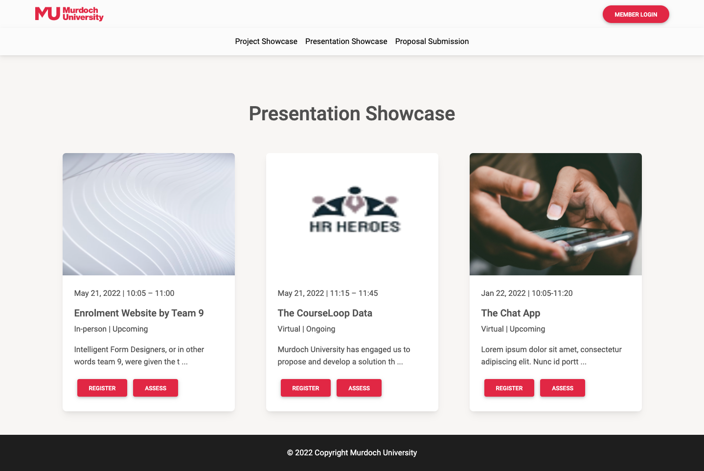
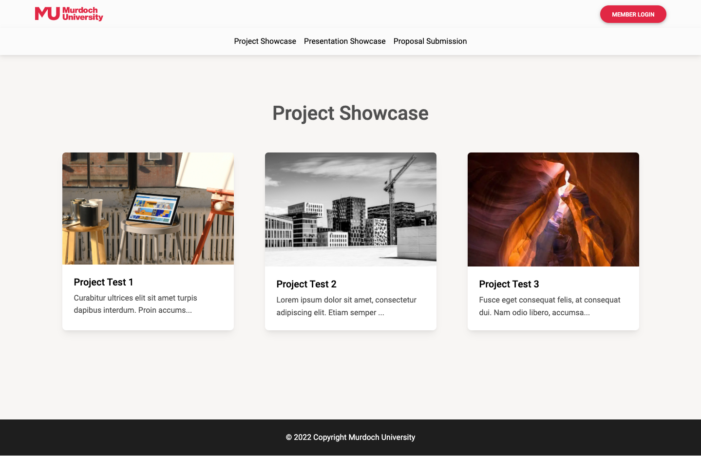
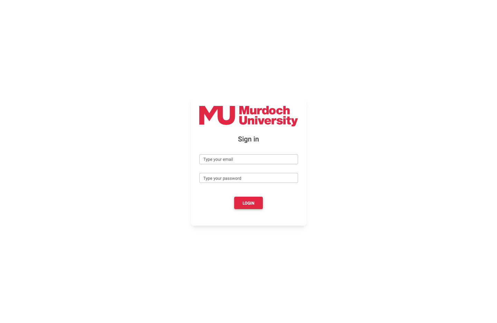
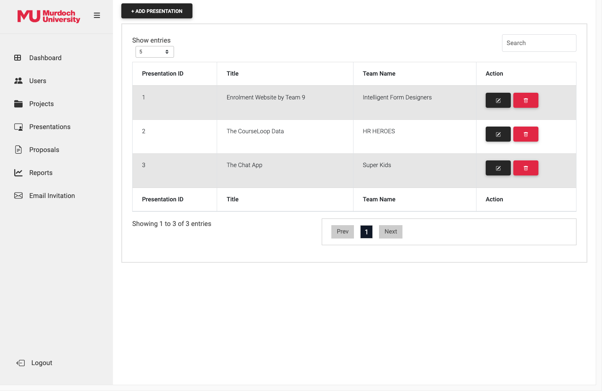
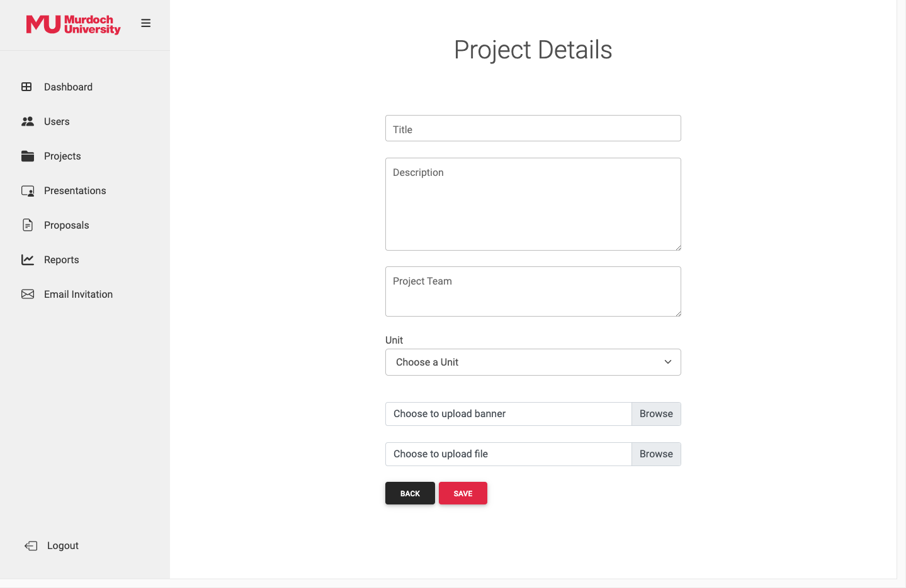
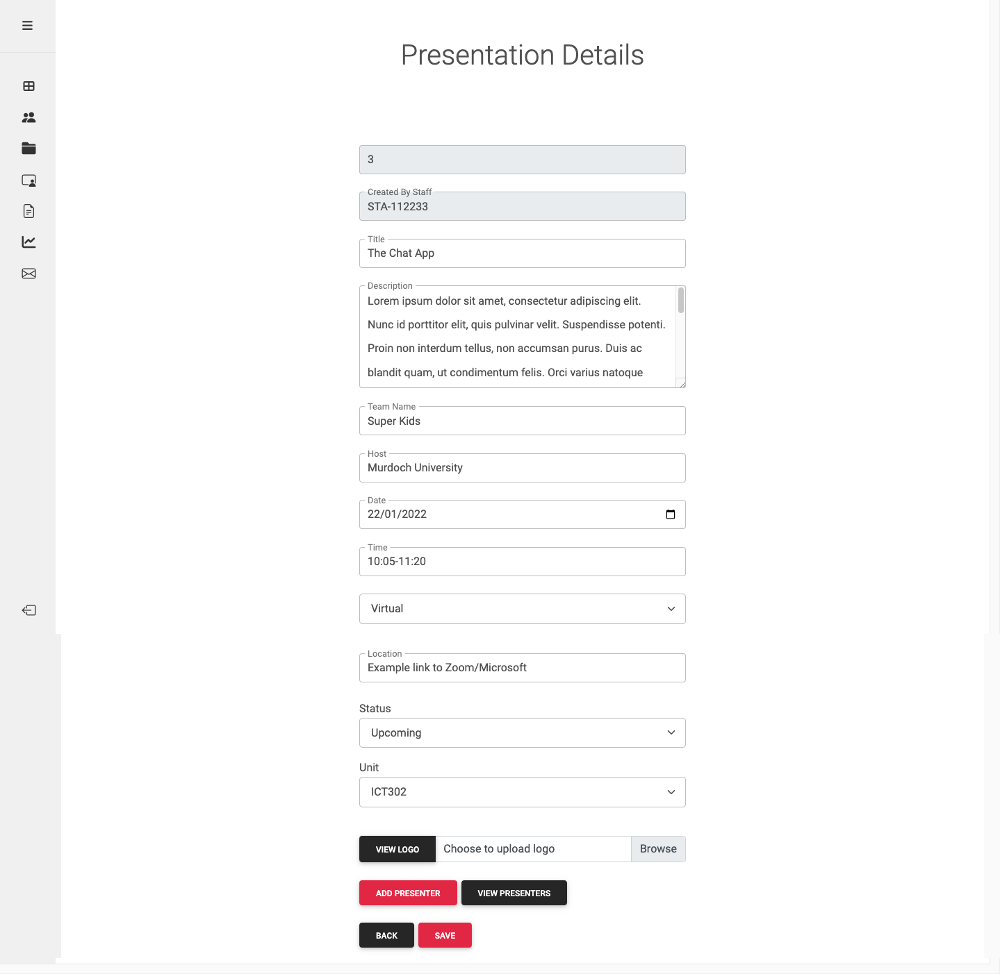
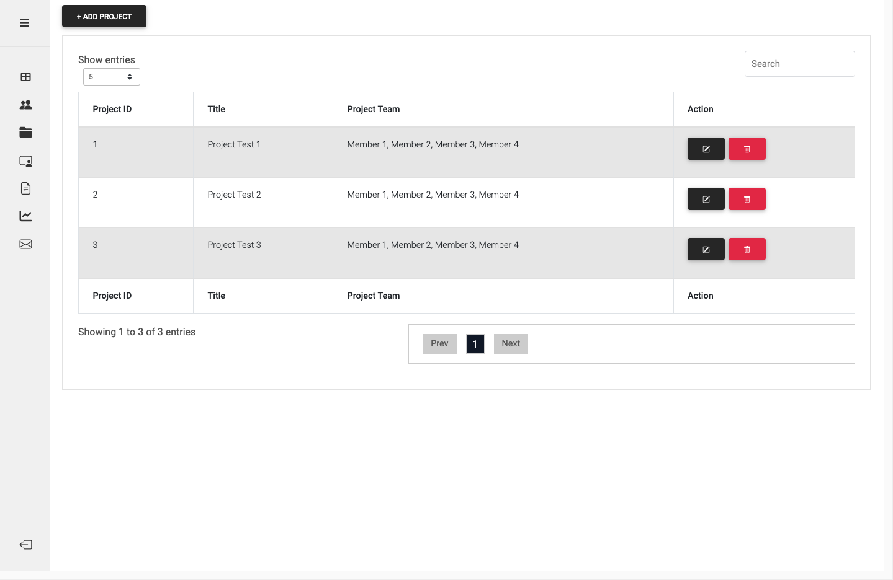
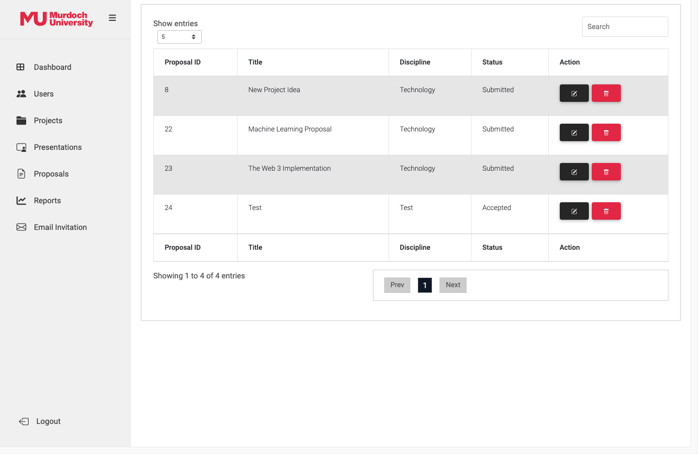
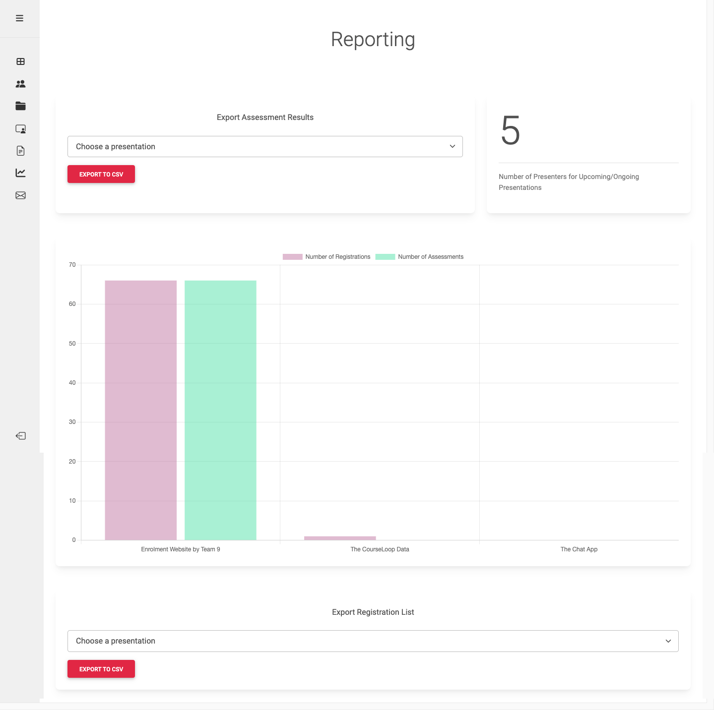
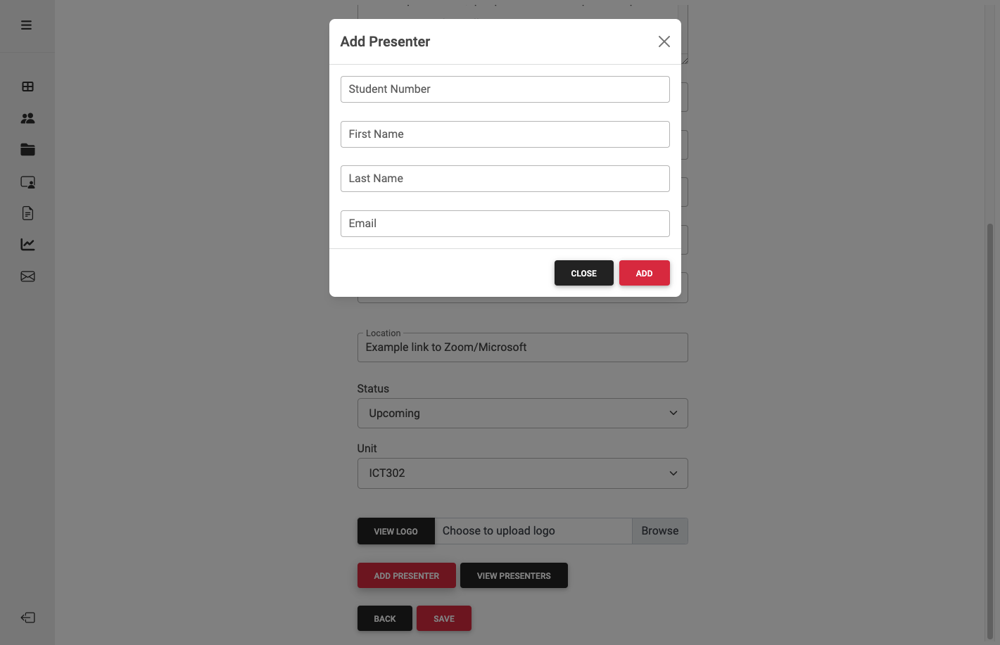

# Project Portal React App

Project Portal App is developed to manage the completed projects easily as well as the upcoming project presentations of the students.

It has an interface that enables to invite potential attendees of a presentation and will allow external clients to submit proposals to the University while showcasing the completed projects and inform about upcoming presentations. The application will also record project assessments from attendees allowing to collect data and determine the performance of each project smoothly. The data collected can be used to generate reports and view the statistic performance of a presentation

# Technologies Used

- Axios
- React
- React-DOM
- React-Router-DOM
- EmailJS
- Bootstrap
- CDB React
- Chart.js
- Material UI
- Toastify
- Express
- CORS
- Multer
- Nodemon
- MYSQL2

# App Preview

    
    
    
    
    
    
    
    
    
    

